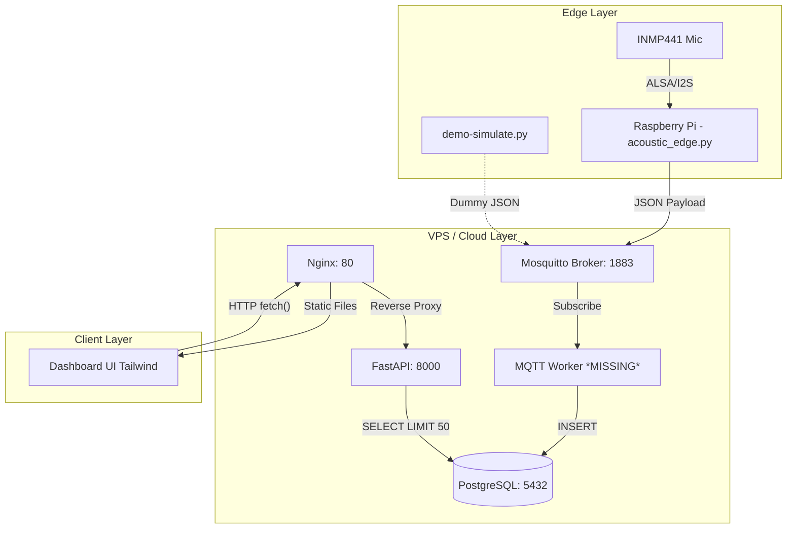
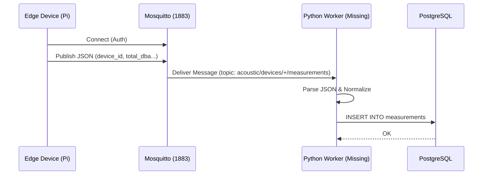
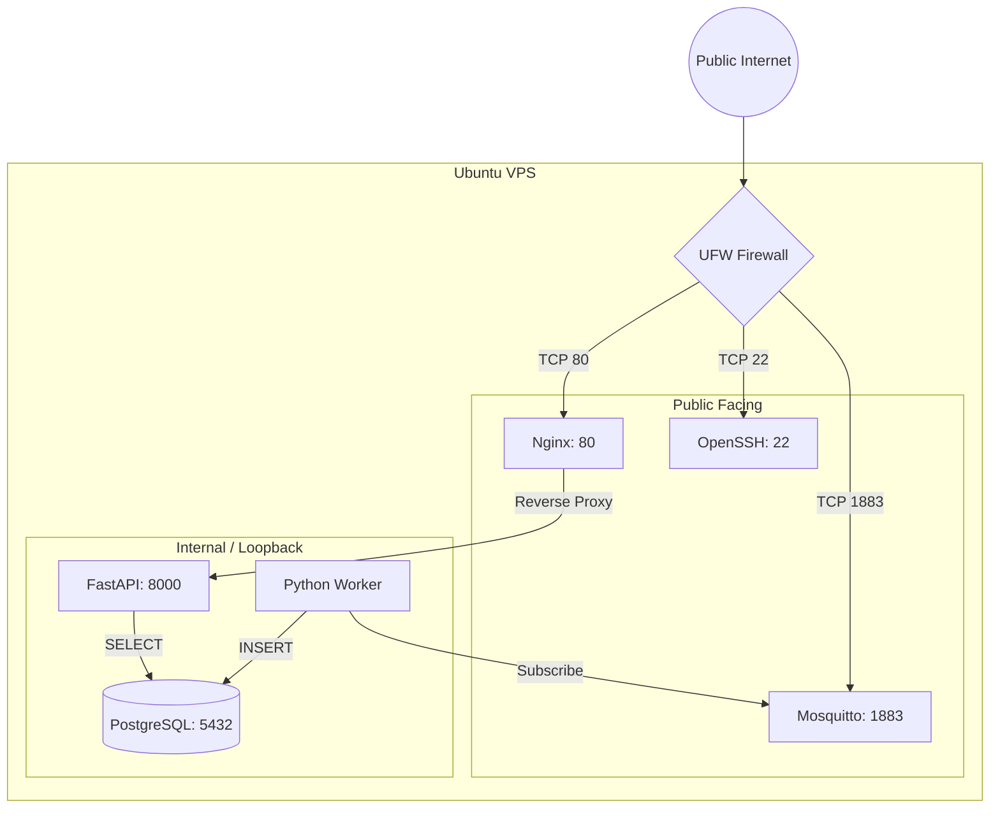
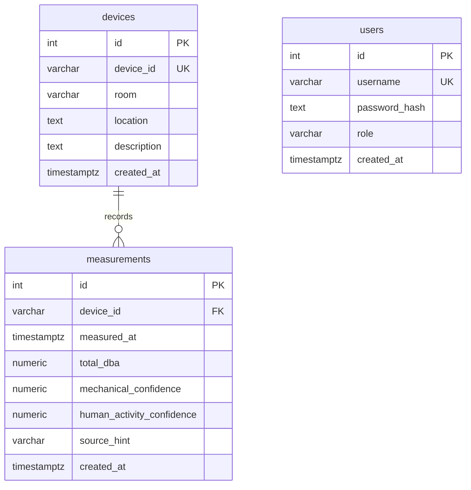

# Phase 1: Diagram Inputs & Architecture Reference (Updated)

This document synthesizes the findings from the Phase 1 Repository and VPS audits based on the latest codebase state (`main` branch), providing the necessary inputs for constructing detailed architectural diagrams.

## 1. Full System Components
*   **Edge Device**: Real Raspberry Pi implementation (`acoustic_edge.py`) using `arecord` (ALSA) to read from an INMP441 I2S microphone, processing RMS and estimating dBA in Python. A simulator (`demo-simulate.py`) is also available as a fallback.
*   **MQTT Broker**: Eclipse Mosquitto serving as the message bus on port 1883.
*   **Worker Service**: **(Missing in Source)** A systemd service (`acoustic-worker.service`) expects a Python daemon to consume and ingest messages into PostgreSQL, but the `worker.py` script is currently absent from the tracked repository.
*   **Database**: PostgreSQL relational database storing devices, users, and measurements.
*   **Backend API**: Minimal Python FastAPI application (`app.py`) served via `uvicorn`. It directly uses `psycopg2` `RealDictCursor` for querying. Authentication is currently stubbed out (no active JWT).
*   **Web Server / Proxy**: Nginx serving static files and reverse-proxying API traffic via `acoustic-nginx.conf`.
*   **Frontend Dashboard**: Vanilla HTML/JS frontend utilizing TailwindCSS (v4.3.0) for styling via `package.json` scripts. No heavy frameworks (React/Vue) or charting libraries (Chart.js removed).

## 2. Data Flow
1.  **Ingestion Path**:
    *   `acoustic_edge.py` invokes `arecord` to capture raw S32_LE audio bytes.
    *   Python unpacks the struct, calculates the Root Mean Square (RMS), and applies linear calibration (`CALIBRATION_SCALE`, `CALIBRATION_OFFSET`) to produce a dBA estimate.
    *   Payload is published via MQTT to `acoustic/devices/{DEVICE_ID}/measurements`.
    *   Mosquitto routes the message to the Worker service (assumed).
    *   Worker executes `INSERT` into PostgreSQL (assumed).
2.  **Consumption Path**:
    *   Client accesses Dashboard; JS fires a basic `fetch()` to `/api/measurements` on `DOMContentLoaded`.
    *   Nginx intercepts request on Port 80 and proxies to FastAPI on Port 8000.
    *   FastAPI queries the top 50 measurements using raw `psycopg2` execution.
    *   JSON payload returns through Nginx to the Dashboard for rendering into a basic HTML table.

## 3. Trust Boundaries
*   **Public -> Nginx**: Untrusted HTTP traffic. Currently, both static files and API routes are unauthenticated (JWT logic has been stubbed).
*   **Public -> Mosquitto**: Untrusted MQTT traffic. Enforces username/password authentication via `password_file` (if configured in broker).
*   **Worker/API -> PostgreSQL**: Trusted local interaction (loopback) utilizing environment variable credentials (`.env`).
*   **Nginx -> API**: Trusted local reverse proxy forwarding.

## 4. Network Boundaries
*   **External (Public IP)**:
    *   Port `80/tcp` (HTTP) - Nginx
    *   Port `1883/tcp` (MQTT) - Mosquitto
*   **Internal (127.0.0.1 / ::1)**:
    *   Port `8000/tcp` (HTTP) - Uvicorn/FastAPI
    *   Port `5432/tcp` (PostgreSQL) - DB instance

## 5. Database Entities (Expected from Schema)
*   **`devices`**: `id` (PK), `device_id` (UQ), `room`, `location`, `description`, `created_at`
*   **`users`**: `id` (PK), `username` (UQ), `password_hash`, `role`, `created_at`
*   **`measurements`**: `id` (PK), `device_id` (FK to devices), `measured_at`, `total_dba`, `mechanical_confidence`, `human_activity_confidence`, `source_hint`, etc.

## 6. API Endpoints
*   `GET /api/health`: Unauthenticated health check.
*   `GET /api/measurements`: Fetches the latest 50 measurements (hardcoded limit, no dynamic filtering).
*   `POST /api/login`: Stubbed endpoint (JWT to be implemented in M3).

## 7. Security Layers
*   **Firewall**: UFW restricting public ports to 22, 80, and 1883.
*   **Transport**: Currently unencrypted (MVP limitation).
*   **Application**: 
    *   API Authentication: **None active** (stubbed).
    *   Secrets: `.env` files used across services.

## 8. Current Codebase Flaws & Risks (Pro-Mode Gaps)
*   **Missing Component**: The MQTT to PostgreSQL Worker script (`worker.py`) is missing from the repository, breaking the ingestion pipeline on fresh deploys.
*   **Hardcoded Systemd Paths**: Deployment files (`acoustic-api.service`, `acoustic-worker.service`, `acoustic-nginx.conf`) hardcode user-specific absolute paths (e.g., `/home/kazee/...`) instead of standard `/opt/` or user-agnostic paths.
*   **Security Regression**: JWT authentication has been removed/stubbed out in `app.py`, leaving `/api/measurements` fully open.
*   **Frontend Simplification**: Loss of auto-polling and Chart.js visualizations.
*   **SQL Injection Vulnerability?**: The current API does not accept dynamic params, but if it did, `psycopg2` direct string manipulation must be carefully monitored.

---

## 9. Mermaid Diagram Drafts

### Full System Architecture

### Edge Pipeline (Real Hardware)

```mermaid
graph LR
    HW[INMP441 Microphone] -->|I2S S32_LE Audio| ALSA[arecord]
    ALSA -->|Raw Bytes| PY[acoustic_edge.py]
    PY -->|struct.unpack| RMS[RMS Calculation]
    RMS -->|Linear Calibration| DBA[dBA Estimate]
    DBA -->|Heuristics| CONF[Confidence Engine]
    CONF --> JSON[JSON Payload]
    JSON -->|MQTT Publish QOS 1| M[Mosquitto]
```

### MQTT Ingestion Sequence

### Deployment & Network Architecture

### Database ERD

